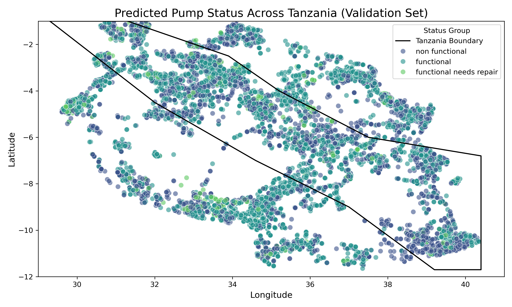
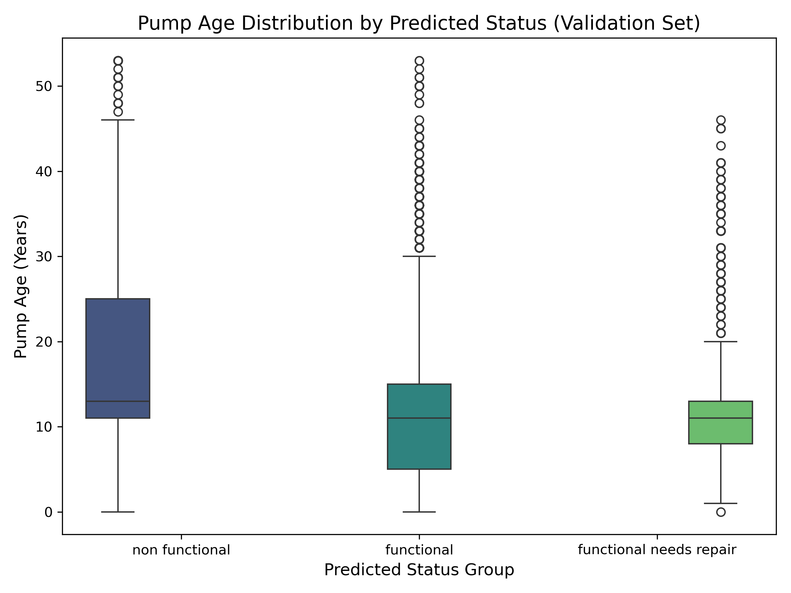
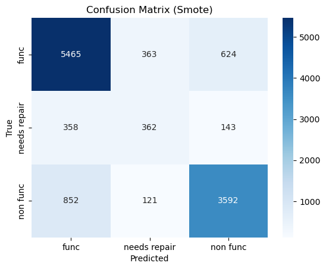

# Tanzania Water Pump Prediction Project


Hey everyone! This project is all about figuring out which water pumps in Tanzania are working, need a tune-up, or are totally busted. Why? To help get clean water to more people! I teamed up with an AI buddy (thanks, Grok!) to dig into the data, clean it up, build a smart model, and show off what we found. Here’s the full story of how we went from messy numbers to a tool that predicts pump conditions—hope you enjoy the ride!

---

## The Starting Line: What We Had
We got our hands on data for 59,400 water pumps—cool stuff like where they are (`longitude`, `latitude`), how old they are (`construction_year`), and how much water they’re pumping (`quantity`). The goal was to predict three statuses:
- `functional` (working fine, 54% of pumps)
- `functional needs repair` (needs a fix, only 7%)
- `non functional` (broken, 38%)

But the data? Kind of a mess—missing values, weird zeros, and way too many unique names for things like waterpoint names (`wpt_name`). Time to roll up our sleeves!

---

## Exploring the Data: First Clues
Before jumping in, we poked around to see what the data was telling us. One big clue came from looking at water flow (`quantity`) versus pump status. Check this out:

| Quantity       | % Functional | % Needs Repair | % Non Functional |
|----------------|--------------|----------------|------------------|
| dry            | 2.5%         | 0.6%           | 96.9%            |
| enough         | 65.2%        | 7.2%           | 27.5%            |
| insufficient   | 52.3%        | 9.6%           | 38.1%            |

- **Wow Moment**: If a pump’s `dry`, it’s almost always broken (96.9% non functional). If it’s got `enough` water, it’s usually working (65.2% functional). This `quantity` thing was gold—we knew it’d be a star in our model!

---

## Cleaning House: Making the Data Work
The data needed some love before we could use it. Here’s what we did:
- **Tossed the Trash**: Dropped columns like `amount_tsh` (mostly zeros), `wpt_name` (37,000+ unique names—yikes!), and `recorded_by` (just one value).
- **Filled the Gaps**: Fixed missing stuff—set `construction_year` zeros to regional medians (around 2000), turned `longitude` zeros into nearby averages, and marked missing `installer` as “Unknown.”
- **Added a Trick**: Made a new feature, `pump_age`, by subtracting `construction_year` from the inspection year (`date_recorded`). Older pumps might be more likely to break, right?

Here’s how we cooked up `pump_age`:
```python
train_df['pump_age'] = pd.to_datetime(train_df['date_recorded']).dt.year - train_df['construction_year']
```

## Building the Prediction Machine
With clean data, we got to the fun part—teaching a computer to guess pump statuses! We started with a Random Forest model (like a team of decision trees), which hit 80.2% accuracy out of the gate. But that needs repair group (only 7%) was tough; only 35% caught. Here’s the first score:

- __Accuracy__: 80.2%
- `functional`: 84% right (F1 score)
- `needs repair`: 41% right
- `non functional`: 81% right

The minority class needed help, so we used SMOTE; a trick to make more examples of `needs repair` pumps. After retraining, we landed here:

- __Accuracy__: 79.3%
- `functional`: 83% right
- `needs repair`: 42% right (caught 42% of them—up from 35%!)
- `non functional`: 81% right
- __Macro F1__: 0.69 (a balanced score across all three)

Final model snippet:
```python
from imblearn.over_sampling import SMOTE
smote = SMOTE(random_state=42)
X_smote, y_smote = smote.fit_resample(X, y)
rf_final = RandomForestClassifier(n_estimators=100, random_state=42)
rf_final.fit(X_smote, y_smote)
```


### What Makes Pumps Tick (or Not)?
The model spilled the beans on what matters most. Here’s the top 10 lineup:

Top 10 Feature Importances

- __Location Rules__: latitude (0.105) and longitude (0.102) are the MVPs; where a pump is says a lot about its condition.
- __No Water, No Go__: quantity_dry (0.070); if it’s dry, it’s toast.
- __Height & Age__: gps_height (0.053) and pump_age (0.040); higher up or older pumps struggle.
- __Who Built It__: installer (0.043); some installers seem better than others!

### Seeing the Story in Pictures
We made some visuals to show what’s up:

- __Map of Tanzania__: Dots for each pump, colored by prediction—purple for `functional`, green for `needs repair`, yellow for `non functional`. Dry middle = yellow, wet northwest = purple.
- __Pump Age__: Older pumps (15+ years) lean yellow; check this out:


- __Scorecard__: A confusion matrix shows where we nailed it or slipped:



### The Finish Line: What We Found
Our final model hits 79.3% accuracy—pretty darn good! It’s best at spotting `functional` (83%) and `non functional` (81%) pumps, and now catches 42% of those `needs repair` ones (up from 35%). Here’s the scoop:

- __Dry Spots Break__: Pumps in central Tanzania (think Dodoma) are often `non functiona`l, not enough water.
- __Wet Spots Win__: Near Lake Victoria, pumps stay functional.
- __Old Pumps Fade__: The longer a pump’s been around, the more likely it’s kaput.

Why It Matters
This tool’s a practical helper; 79% right means we can trust it to point out pumps to fix or replace. Flagging more needs repair pumps could stop breakdowns before they happen, especially in dry areas with old gear. It’s not perfect (that needs repair precision could use a nudge), but it’s a big step toward keeping water flowing.


# Thank You!